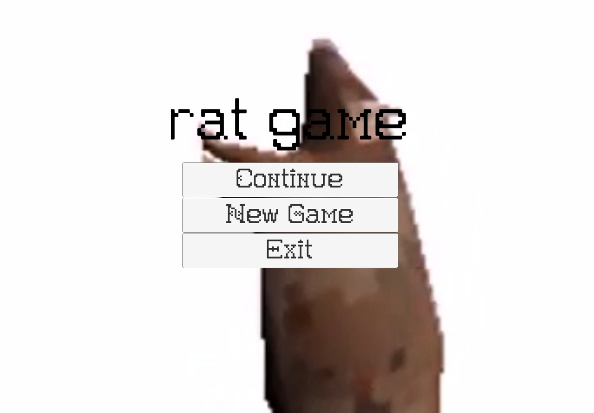
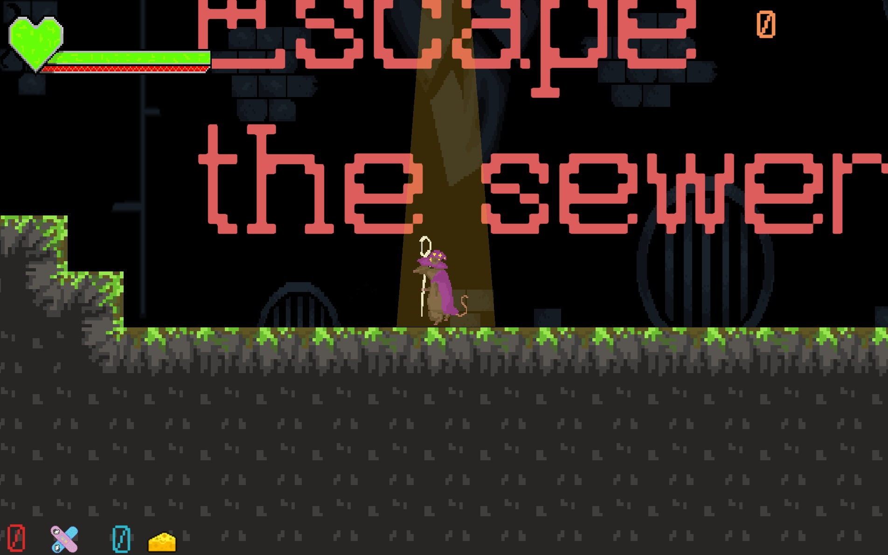
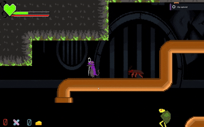
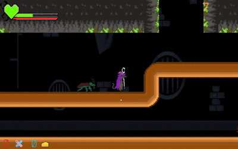
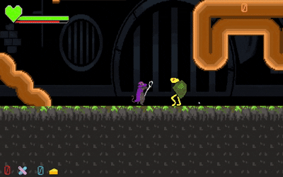
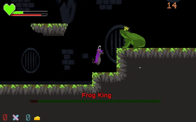
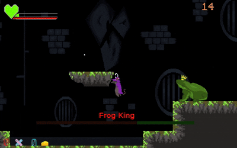

# Rat-game
Et spill utviklet i Unity som et klasseprosjekt på folkehøyskole i året 2022/2023.
Merk: dette er en re-upload av prosjektet. Originalt versjonskontrollsystem var PlasticSCM (via Unity), og commit-historikken er derfor ikke bevart her.

## Teknologi
Unity v2021.3, C#, PlasticSCM for versjonskontroll og samarbeid.

## Om prosjektet
Langtidsprosjekt på Namdals FHS sammen med klassen. Vi hadde to måneder på å "fullføre" spillet. Spillet er en klassisk metroidvania platformer.

## Min rolle
Prosjektansvarlig.
Bugfiksing og annet nødvendig arbeid.

## Mangel på engasjement
Ettersom dette var et folkehøyskole prosjekt, var det en varierende grad av interesse for å gjøre faktisk arbeid. Det var enkelte gruppemedlem som slet med motivasjon. Det var da min jobb som prosjektleder å finne arbeidsoppgaver som engasjerte og motiverte mine klassekamerater. Løsningen ble at vi startet med audio design før vi hadde planlagt slik at gruppemedlemmet fikk gjøre det de ønsket og dermed fikk tilhørighet til prosjektet. Vi slet også med at vi var for mange som kunne programmere, og for få som likte å tegne, dermed slet vi med å få grafikken til å være likestilt med kodeutviklingen. Løsningen her ble at vi aksepterte en stor forskjell i kunststil og kvalitet, for å ha nok oppgaver til alle sammen. Det ble etterhvert lettere å få mer kunst til spillet ettersom enkelte fant ut at de likte å lage kunst.

## Demonstrasjon
Dette er et prosjekt fra da vi var yngre, så spillet har et par tullete element. Spillet blir åpnet til denne hovedmenyen.

Dersom du trykker "New Game", vil du bli sendt til første scene.

### Noen fiender fra spillet
Den røde kakerlakken er den vanligste fienden og går frem og tilbake uten å ta hensyn til spillerens posisjon.

Den blå kakerlakken er en variant av den røde kakerlakken. Denne vil følge spilleren.

Skilpadden har et skjold på ryggen og kan dermed ikke ta skade bakfra. Den vil også snu seg mot spilleren.

Siste slåsskampen i spillet er en bossfight. Denne kampen har to faser. I første fase vil frosken stå stille litt, før den forsvinner opp, så lander i nærheten av spilleren.

Da frosken har under halve helse igjen, begynner den å skyte prosjektiler på spilleren, i tillegg til å beholde det gamle angrepsmønsteret. Det ble aldri en skikkelig slutt på spillet, så etter å ha slått frosken må man starte et nytt spill fra hovedmenyen.

## Hvordan kjøre spillet
For å kjøre spillet, må du laste det ned.
Spillet ligger ute på itch.io: https://shmen.itch.io/rat-game (opplastet av en klassekamerat)
